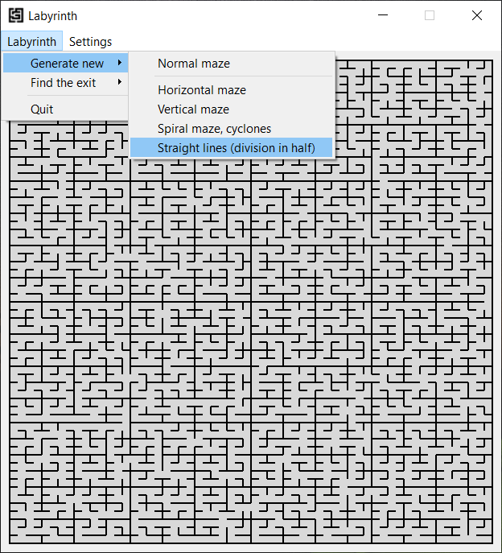
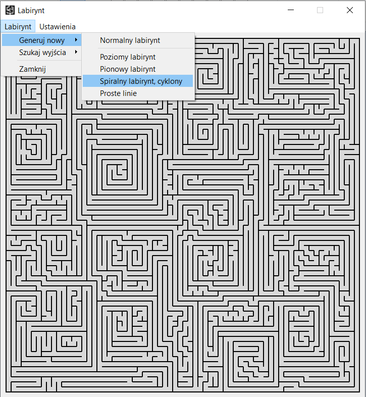

# Labyrinth
Project assumptions:
- Creating an algorithm (or algorithms) to generate the correct Labyrinth
- The maze has one entrance and one exit
- The object looking for the exit does not know the algorithm structure
- The object is blind (it's dark in the maze)
- writing and testing exit searching algorithms

#### Project under construction
finished:
- [x] menu in several languages (language class)
- [x] maze size settings window
- [x] cell skeleton (we work with bits, not bytes)
- [x] labyrinth generation algorithm by the method of straight lines (division in half)
- [ ] labyrinth generation algorithm by the method of straight lines (random split) (80& complete)
- [ ] labyrinth generation algorithm - Zigzags method
- [x] labyrinth generation algorithm by DFS method [Link](https://pl.qwe.wiki/wiki/Depth-first_search)
    - normal maze
    - hozirontal maze
    - vertical maze
- [x] labyrinth generation algorithm - spiral, cyclones (my algorithm)
- [x] board skeleton and drawing
- [ ] solving algorithms

Creating algorithms:
 - [ ] Labyrinth generation (straight lines & recursive method) (60% completed)
 - [ ] Solving: Blintfold (right hand)
 - [ ] Solving: Blinfold (left hand)
 - [ ] Solving: Brute Force
 - [ ] Solving: Wave propagation (wave of water)
 - [ ] Solving: Time table (time of passing the segment)
---
tools:
- QT Creator 4.12.3
- programming language: C++
- OS (test/compilation): Windows 10 Pro / 64bit
---
### Ways and idea of solution:
* Description of the ways -> [MicroMouse robots](https://forbot.pl/blog/roboty-micromouse-5-metod-przeszukiwania-labiryntu-id17354)
* The shortest path in the graph -> [BELLMAN-FORD algorithm](https://pl.wikipedia.org/wiki/Algorytm_Bellmana-Forda)
* https://pl.qwe.wiki -> [Wiki](https://pl.qwe.wiki/wiki/Maze_generation_algorithm)
---
### Screens
     
    